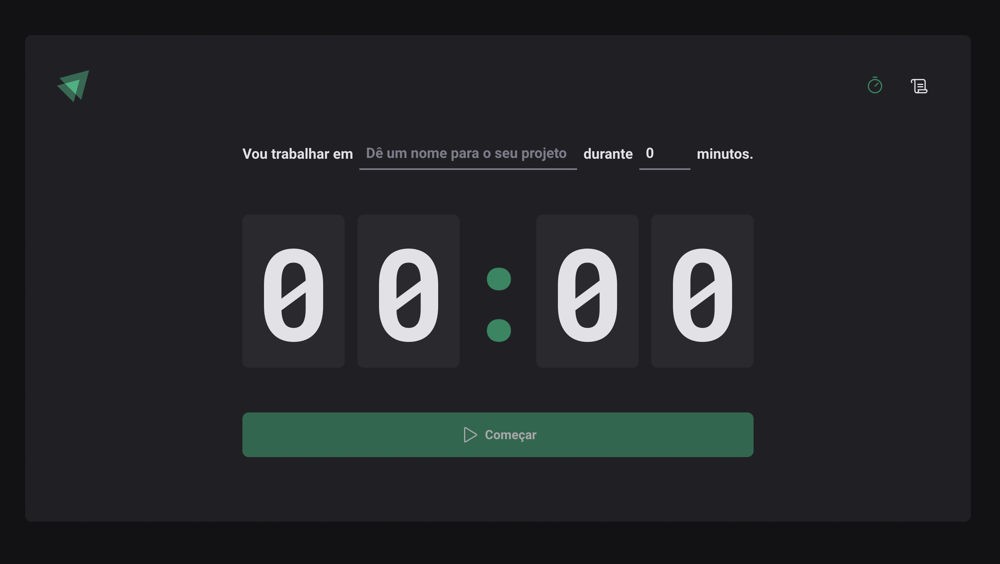
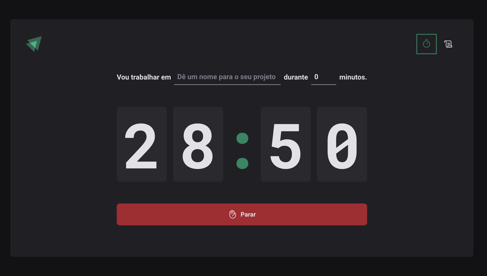
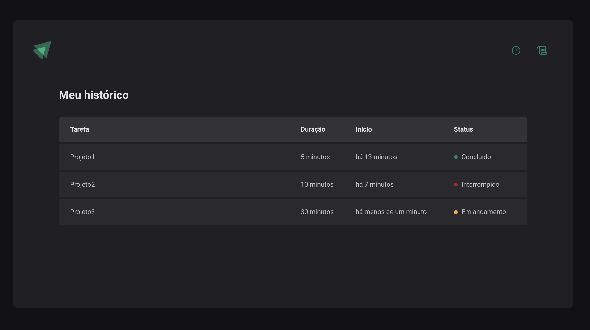

<h1 align="center">
  Timer
</h1>

<p align="center">
  <a href="#-tecnologias">Tecnologias</a>&nbsp;&nbsp;&nbsp;|&nbsp;&nbsp;&nbsp;
  <a href="#-projeto">Projeto</a>&nbsp;&nbsp;&nbsp;|&nbsp;&nbsp;&nbsp;
  <a href="#-executando">Executando</a>&nbsp;&nbsp;&nbsp;|&nbsp;&nbsp;&nbsp;
</p>

<p align="center">
 

  
</p>

<br>

<p align="center">
  
</p>

<p align="center">
  
</p>

<p align="center">
  
</p>

## 🚀 Tecnologias

Esse projeto foi desenvolvido com as seguintes tecnologias:

- React
- React Router Dom
- Context API, useReducer
- Styled components
- Phosphor icons
- Immer JS
- ESLint
- Date-fns
- Zod

## 🔖 Projeto

O projeto Timer foi idealizado para seguir a técnica de gerenciamento de tempo chamada Pomodoro. Esta técnica tem como objetivo o aumento da produtividade ao realizar uma determinada tarefa, utilizando um timer e fazendo pequenos intervalos entre cada finalização da contagem do tempo até concluir as tarefas programadas para serem finalizadas em cada timer.

## 💻 Executando

O projeto foi criado utilizando o ambiente de desenvolvimento `vite`
Para maiores informações consultar [documentação](https://vitejs.dev/guide/)

```sh
  # Instalando as dependências do projeto.
  $ npm install 
  # Inicie a aplicação
  $ npm run dev 
```

Feito por Diego Almeida :wave: #TrilhaIgnite #Rocketseat 🚀